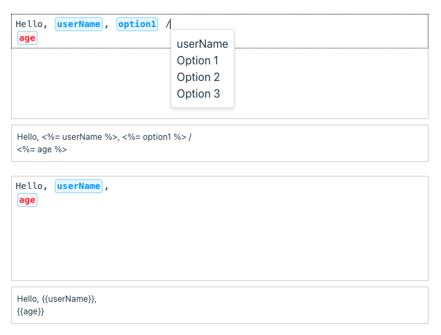

# Codemirror Variable Editor

This is a simple variable editor for codemirror. It allows you to edit variables in a code editor.

## Support

### mode support template and variables

- lodash template syntax is supported.
  ```
  <%= variable %>
  ```

- variables is supported.
  ```
  {{variable}}
  ```

### slash select variable

## Example



